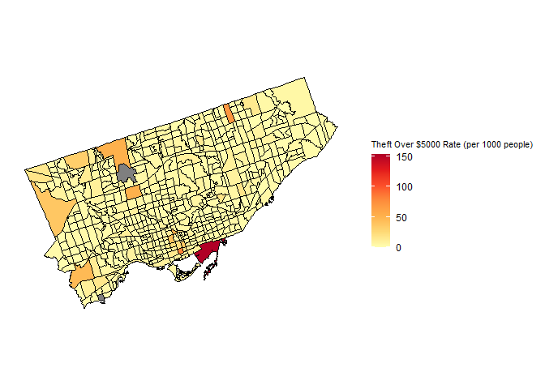
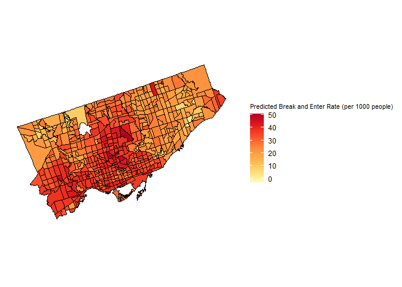

<!-- README.md is generated from README.Rmd. Please edit that file -->

# The Effects of Income and Unemployment on Crime in Toronto

<!-- badges: start -->
<!-- badges: end -->

Annie Cheng (400298037)  
Kenzie Dorgelo (400374596)  
Sam Fanaki (400297172)  
Iris Huang (400295138)  
Jefferson Lam (400272316)  
Yiyao Li (400258214)  
William Russell (400199227)  
Julian Vella (400408707)

Final project for **ENVSOCTY 4GA3** [Applied Spatial
Statistics](https://academiccalendars.romcmaster.ca/preview_course_nopop.php?catoid=53&coid=267722)
(McMaster University)

## Abstract

This paper reports our analysis of crime data in Toronto, Ontario,
Canada, and its relationship with income and unemployment rate at the
level of census tracts. Data were obtained from the Toronto Police
Services and the Canadian Census.

<!--Chunks of code can have names; the chunk option "include" controls whether the chunk and its output are printed in the final document-->
<!--This create a page break, i.e., starts a new page-->
<!--\newpage-->
<!-- 
To cite references in your bibliography.bib file, use [@item] if you want it to be cited in brackets, or @item if you want it to be cited as Name (year). If you want to cite various items in brackets, separate them with semicolons [@item1; @item2]
-->
<!--Use "#" for section headers-->

# Introduction

Police-reported crimes in Canada have demonstrated an unsettling
increase for two consecutive years (Government of Canada, 2023). This
concerning trend is particularly acute in urban areas like Toronto,
where the confluence of socioeconomic disparities and crime rates
presents complex challenges. As Canada’s largest metropolitan city, with
a population nearing 3 million (OECD, 2024), Toronto represents the
future of other Canadian metropolitan areas. However, the persistent
upward trajectory, notably in property crimes, including theft,
constitutes approximately 15% of total crime occurrences between 2014
and 2022. This raises the question of what factors are causing this
trend. This report aims to explore the relationships between income and
unemployment and how they may lead to theft-related crimes in Toronto.
To assess any possible relationships, previous studies have been
analysed, and correlations between both income and unemployment have
been identified as having possible connections to criminal activity.

# Background

Crime rates are influenced by a variety of factors, with unemployment
and income playing a significant role in shaping criminal activities.
Research has shown that these two factors have a positive correlation
with crime rates (Dizman, 2020). Those with lower economic status can
resort to crime, highlighting the impacts of economic factors on
criminal behaviour (Rehaman, 2022). Moreover, the effects of income on
crime have been a subject of interest, with studies suggesting that
economic welfare plays a crucial role in crime reduction (Bianchi &
Chen, 2021).

From 2021 to 2023, auto theft in Toronto has seen a notable rise, with a
nearly 85% increase within this time range, with 6,642 reported auto
thefts in 2021 and 12,262 in 2023 (Toronto Police Service, 2024). To put
that into perspective, roughly 34 vehicles are stolen daily, or every 40
minutes (Fanfair, 2024). The neighborhood with the most auto theft took
place in West Humber Clairville, with 833 cases (Toronto Police Service,
2024). This neighborhood is located on the outer border of Toronto, and
in 2020, 12.9% of the population was considered low-income, and roughly
10% were unemployed (City of Toronto, 2023). The high volume of auto
theft in the outer regions of Toronto makes them more susceptible to the
effects of the changing economic landscape caused by the pandemic. This
indicates that this portion of the population is more likely to resort
to criminal activity. As the chief of police has noted, vehicle theft is
a lucrative business right now because of the high demand, and with
that, criminals are migrating towards an easy payday (Fanfair, 2024).

In terms of bike thefts, there was a small spike in Toronto from 2022 to
2024, as according to the Toronto Police Service Public Safety data,
bike thefts total rose from 323 to 424. About 40% of these took place in
residential areas (Toronto Police Services, 2024). The rise of bike
thefts over the years is caused by a similar reason to auto thefts, as
for thieves and criminals they are a way to mitigate their own economic
challenges and status. Bicycle thieves see the reward as being far
greater than the risk of stealing vehicles, as stealing bikes is easier
and the chances of getting caught are rare (SoCalcycling, 2022). The
Toronto Police Service suggests that the use of a proper bicycle rack
and bike lock are the best measures to discourage or slow down bike
thieves (Toronto Police Service, 2024). But less privileged
neighborhoods across Toronto aren’t as fortunate, as proper bicycle
racks aren’t as widely available compared to places like the downtown
core.

For the purposes of this study, four types of crime were taken into
consideration. These crimes are robbery, auto theft, break and enter,
and theft over \$5000, standardized as rates per 1000 people. The two
most recent years a Canadian census was collected were 2021 and 2016.
Given that COVID-19 was still heavily affecting global behaviour due to
lockdowns and remote work in the year 2021, 2016 was chosen for
analysis. This should reflect relatively recent typical trends of the
economy as well as criminal activity while being unhindered by drastic
global crises.

# Study area

Crime data was studied at the census tract level for the City of Toronto
(see Figure ). There are 572 census tracts in the City of Toronto, and
569 of these had sufficient income and unemployment data available for
analysis. Toronto was chosen as it is the largest city in Canada with
one of the most diverse populations, resulting in an interesting case
study for analyzing socio-economic trend correlation with crime data.
Census tracts were chosen for this study as opposed to wards,
neighbourhoods, or dissemination areas because they are the finest
possible resolution to show trends in crime data across the city, with
minimal regions containing no data.

<figure>

<figcaption aria-hidden="true">Census Tracts in Toronto, Ontario,
Canada</figcaption>
</figure>

# Data

A shapefile of Toronto Census Tracts was created with crime and census
data associated. To access the census tracts shapefile and census data,
the cancensus package for R was used. 2016 Canadian Census data was
accessed in a simple features format for CSD \#3520005 (The City of
Toronto). The following vectors were accessed: (1) Median Total
Household Income (\$) (vector code: v_CA16_2397), (2) Unemployment (%)
(vector code: v_CA16_5618), and (3) Total Population (vector code:
v_CA16_401). Using the sf package for R, the census data was exported as
a shapefile.

Crime data was accessed in a point shapefile format from the Toronto
Police Service Open Data website. Using the Esri ArcPy package for
Python, crimes committed in 2016 and which were part of one of the
following categories were selected and all other records were removed:
(1) Robbery, (2) Auto Theft, (3) Break and Enter, or (4) Theft Over.

In order to resolve instances of crime points being located at the
intersection of multiple census tracts, it was decided that their counts
would be divided among all census tracts they intersected with. The
ArcPy Buffer Analysis tool was used to create a five meter buffer around
each crime point. In the attribute table for these buffers, columns were
created for each crime category, and dummy variables were added which
acted as a count of which crime type occurred for each buffer (i.e, a
value of 1 in the corresponding column.)

Using the ArcPy Apportion Polygon tool, the count of each buffer was
distributed among all intersecting CTs. The output shapefile, which now
contained both census and crime data, was then exported for further
analysis in R.

In R, the shapefile was read and projected to NAD 1983 UTM Zone 17N
(EPSG: 32617) using the sf package. This was necessary to allow nearest
neighbour functions in this study to take values in metres as arguments.
Crime rates were calculated from the absolute values of crimes committed
per census tract divided by the population of the census tract, and
multiplied by 1000 to standardize it as rates per 1000 people. Three
census tracts contained zero data for income due to privacy concerns,
which were filtered out from the dataset using the filter function from
the dplyr package (part of the tidyverse collection), to allow the
following data processing to work with complete data points only.

# Methods

This study uses RStudio to conduct a series of data processes to
visualize and find correlations between socio-economic variables and
crime rates for census tracts in Toronto, Ontario, Canada. The
independent socio-economic variables used in this study are median
income and unemployment rate, and the dependent variables, the four
types of crime analyzed are robbery, auto theft, break and enter, and
theft over \$5000, standardized as rates per 1000 people.

The analysis used several R packages, including sf, ggplot2, ggpubr,
scales, spdep, tidyverse, and spatialreg. For the initial visualization
and analysis of the area data, choropleth maps and Moran’s I tests and
plots were used to identify patterns and spatial autocorrelation in the
data. Then, Kendall’s tau correlation tests and regression analysis was
used to gain insight on the processes behind these spatial patterns, as
well as any relationship between the independent and dependent
variables. Finally, spatial lag models were created using insights
gained from the Moran’s I tests, Kendall’s tau correlation and
regression analysis models, to predict where each type of crime is most
likely to occur given median income and unemployment data.

This document was also written and exported through R-Markdown with
minimal adaptation from Steven V. Miller’s template for academic
manuscripts. See:
<http://svmiller.com/blog/2016/02/svm-r-markdown-manuscript/%5Bhttps://github.com/svmiller/svm-r-markdown-templates/blob/master/svm-latex-ms.tex>\]
and
(<https://github.com/svmiller/svm-r-markdown-templates/blob/master/svm-latex-ms.tex>)

The data and code used in this project can be found on Github:
<https://github.com/jujujames/4GA3_Group1_FinalReport>. This document is
also available as an RMarkdown file, which includes both the code and
the text used to create this report.

# Analysis

## Data Exploration

First, choropleth maps were created to display the distribution of data
and explore the relationship between income (Figure ), unemployment
(Figure ) and theft rate by classification (Figures 4-7) in Toronto in
2016.

<figure>

<figcaption aria-hidden="true">Median Income of Toronto Census
Tracts</figcaption>
</figure>

In Figure , it can be seen that the neighbourhoods with above-average
income are concentrated in the centre (Northern Old Toronto) and
southwest (Etobicoke) regions of Toronto. The cluster of neighbourhoods
in Northern Old Toronto are characterized by much higher incomes (above
\$600,000) than the median income across the whole city, while the
cluster in Etobicoke is another high-income area (approximately
\$400,000).

<figure>

<figcaption aria-hidden="true">Unemployment Rate of Toronto Census
Tracts</figcaption>
</figure>

Figure shows the unemployment rate does not appear to represent a
particular spatial pattern throughout the city. Northern Old Toronto,
Downtown Toronto, and Southern Etobicoke display relatively lower
unemployment rates compared to the northernmost parts of North York and
Etobicoke, and Scarborough regions.

Figures 4-7 depict information on theft rate in Toronto calculated in
rates per 1000 people, classified by robbery rate (Figure ), auto theft
rate (Figure ), break and enter rate (Figure ), and the rate of theft
over \$5000 (Figure ).

<figure>

<figcaption aria-hidden="true">Robbery Rate (per 1000 people) of Toronto
Census Tracts</figcaption>
</figure>

From Figure , the robbery rate tends to occur in the downtown core, one
tract in Northern Scarborough, and a couple of tracts in northernmost
North York. In particular, the highest robbery rates occur in a census
tract adjacent to Lake Ontario in the south and a census tract in
northern Scarborough.

<figure>

<figcaption aria-hidden="true">Auto Theft Rate (per 1000 people) of
Toronto Census Tracts</figcaption>
</figure>

The auto theft rate in Figure follows a different trend compared to the
robbery rate, which is concentrated primarily in northwest Etobicoke.
Etobicoke as a whole tends to have a higher auto theft crime rate,
particularly a cluster of census tracts in northern Etobicoke, as well
as one census tract in northern Scarborough.

<figure>

<figcaption aria-hidden="true">Break and Enter Rate (per 1000 people) of
Toronto Census Tracts</figcaption>
</figure>

From Figure , the break and enter rate shows similar spatial trends as
the robbery rate. The census tracts with higher rates are concentrated
in the downtown core, one tract in Northern Scarborough, and a couple of
tracts in northernmost North York. In particular, the highest break and
enter rates occur in a census tract adjacent to Lake Ontario in downtown
Toronto, and a census tract in northern Scarborough.

<figure>

<figcaption aria-hidden="true">Theft Over $5000 Rate (per 1000 people)
of Toronto Census Tracts</figcaption>
</figure>

The rate of theft over \$5000 is relatively consistent with the pattern
observed in the cases of robbery and break and enter theft rates.
Scarborough has a few census tracts with moderately higher rates than
most of the city. The tract in the downtown core adjacent to Lake
Ontario exhibits a significantly higher rate of theft over \$5000, while
other tracts in the downtown core, northern Scarborough, and
northernmost North York also show relatively high rates of theft over
\$5000.

## Spatial Autocorrelation

Spatial autocorrelation is an essential factor to consider in the
analysis of crime rates within Toronto before engaging in regression
analysis to understand the impact of socioeconomic variables on the rate
of crime. The non-random patterns of crime distribution are key to using
regression analysis to yield more informative insights into the factors
driving these patterns.

Using a measure of spatial autocorrelation, Moran’s I helps determine
whether the spatial distribution of crime rates is inherently random or
if there is a pattern of spatial dependence. By testing the null
hypothesis that the spatial pattern is random, we can ascertain the
significance of the observed patterns. For each of the Moran’s I tests,
a nearest neighbour threshold of 2222 meters was defined, as the minimum
value to assign at least one neighbour to every census tract.

Tables 1-4: Results of Moran I Spatial Autocorrelation Test for Various
Crime Rates in Toronto
As seen in the results in Tables 1-4, all four tests indicate
significant positive spatial autocorrelation. This means that areas with
high crime rates tend to be clustered together for each type of crime.
This finding can be important for law enforcement and urban planning, as
it suggests that interventions in high-crime areas might not only affect
those specific areas, but also their surrounding regions. The
consistency of negative expectations and very low p-values across all
tests strengthens the evidence that these spatial patterns are not
random but rather a significant characteristic of the dataset.

<figure>

<figcaption aria-hidden="true">Moran’s I Plot for Robbery Rate in
Toronto</figcaption>
</figure>

In the case of the robbery rate within Toronto, Moran’s I statistic is
positive, and the associated p-value is very low (p-value =
3.983×10-10), rejecting the null hypothesis that the spatial pattern is
random. This significant positive Moran’s I statistic indicates a
spatial clustering where high robbery rates are found near other
high-rate areas, and the reverse is true for areas with low rates. This
clustering effect is visually confirmed in Figure , showing a definite
trend of spatial dependence with pockets of high-high and low-low
clustering evident across the city.

<figure>

<figcaption aria-hidden="true">Moran’s I Plot for Auto Theft Rate in
Toronto</figcaption>
</figure>

Similar patterns are observable in the auto theft rate data. The
positive Moran’s I statistic and the extremely low p-value (p-value =
1.475×10-15) indicate non-randomness. Figure illustrates a clear
non-random pattern where high auto theft rates cluster in particular
neighborhoods, affirming the hypothesis of non-random spatial patterns.

<figure>

<figcaption aria-hidden="true">Moran’s I Plot for Break and Enter Rate
in Toronto</figcaption>
</figure>

The break and enter rates demonstrate a positive Moran’s I statistic
with a very small p-value(p-value = 1.824×10-14), leading to the
rejection of the null hypothesis and suggesting a non-random spatial
pattern. Figure underlines this clustering of break and enter incidents,
with areas of high rates situated near similar areas, reinforcing the
concept of spatial autocorrelation within this type of crime.

<figure>

<figcaption aria-hidden="true">Moran’s I Plot for Theft Over $5000 Rate
in Toronto</figcaption>
</figure>

Furthermore, the theft over \$5000 rate shows a positive Moran’s I
statistic, indicating moderate spatial clustering, showing a non-random
pattern confirmed by the low p-value (p-value = 1.463×10-6). The
moderate clusters of both high and low theft rates are identifiable in
Figure , although they are subtler in comparison to the other crime
types.

## Correlation and Linear Regression Analysis

Kendall’s tau correlation provides a quantitative assessment of the
relationships between income, unemployment, and various crime rates in
Toronto. The analysis shows both the direction and strength of these
relationships and is crucial for understanding the socioeconomic
dynamics affecting crime rates. Kendall’s tau correlation was chosen
over other correlation methods due to its robustness against influence
by outliers, which this dataset has a significant number of across all
crime types.

Linear regression analysis between the type of crime and both
socioeconomic variables was performed to find the best-fitting model for
observed data. These regression analyses include linear,
quadratic-transformed, cubic-transformed, and logarithmic-transformed.

<figure>

<figcaption aria-hidden="true">Correlation Analysis of Median Income and
Robbery Rate in Toronto</figcaption>
</figure>

<figure>

<figcaption aria-hidden="true">Correlation Analysis of Unemployment Rate
and Robbery Rate in Toronto</figcaption>
</figure>

Looking at robbery rates, Kendall’s tau correlation with income is weak,
negative and statistically significant (tau = -0.155, p = 3.08e-08),
suggesting that as income increases, robbery rates tend to decrease. The
linear regression model of log-transformed median income corroborates
this with a negative coefficient for income (Estimate = -5.665, p =
7.632e-05), although the model explains a relatively small portion of
the variance in robbery rates (Adjusted R-squared = 0.02553). Kendall’s
tau correlation with unemployment is weak, positive, and statistically
significant (tau = 0.785, p = 0.0054), suggesting that as unemployment
increases, robbery rates tend to increase. The linear regression model
with a quadratic transformation of the unemployment variable
corroborates this with a positive coefficient for unemployment at the
2nd degree (Estimate = 73.8392, p = 4.84e-05), although the model
explains a relatively small portion of the variance in robbery rates
(Adjusted R-squared = 0.03109).

<figure>

<figcaption aria-hidden="true">Correlation Analysis of Median Income and
Auto Theft Rate in Toronto</figcaption>
</figure>

<figure>

<figcaption aria-hidden="true">Correlation Analysis of Unemployment Rate
and Auto Theft Rate in Toronto</figcaption>
</figure>

For auto theft rates, the correlation with income shows a slight
positive trend, and it is statistically significant (tau = 0.142, p =
4.03e-07). This suggests that as income increases, there’s a marginal
tendency for auto theft rates to rise. However, the relationship between
income and auto theft rates is not captured strongly in a linear model,
as indicated by a non-significant p-value (p = 0.0827) from the
regression analysis. Conversely, the link between auto theft rates and
unemployment shows a negative but weak and statistically insignificant
correlation (tau = -0.0497, p = 0.07826). This suggests that
unemployment has a negligible effect on the rate of auto theft. This
lack of significance is confirmed by the linear regression analysis,
which returns a high p-value (p = 0.0244), implying that the regression
model fails to capture any substantial linear effect of unemployment on
auto theft rates, as evidenced by a very low adjusted R-squared value
(Adjusted R-squared = 0.007154), highlighting a minimal explained
variance in auto theft rates by these socioeconomic factors.

<figure>

<figcaption aria-hidden="true">Correlation Analysis of Median Income and
Break and Enter Rate in Toronto</figcaption>
</figure>

<figure>

<figcaption aria-hidden="true">Correlation Analysis of Unemployment and
Break and Enter Rate in Toronto</figcaption>
</figure>

The break and enter rates have a moderately positive, statistically
significant association with income (tau = 0.229, p = 3.099e-16) and a
moderately negative, statistically significant correlation with
unemployment (tau = -0.223, p = 2.302e-15). The regression models show
that both income (Estimate: 4.50e-05, p = 0.003356) and unemployment
(Estimate: -3.0064, p = 6.968e-09) are moderate predictors with a linear
relationship, with higher income associated with higher break and enter
rates and higher unemployment leading to lower rates. However, the
variation explained by both models remains low (adjusted R-squared =
0.01333 and 0.05583, respectively).

<figure>

<figcaption aria-hidden="true">Correlation Analysis of Median Income and
Theft Over $5000 Rate in Toronto</figcaption>
</figure>

<figure>

<figcaption aria-hidden="true">Correlation Analysis of Unemployment Rate
and Theft Over $5000 Rate in Toronto</figcaption>
</figure>

Lastly, the rate of theft over \$5000 has a weak, positive, and
statistically significant correlation with income (tau = 0.081, p =
0.003859), however, the regression model shows that this relationship is
not well-explained linearly. (p = 0.4396). Despite this, other types of
polynomial or logarithmic transformation did not provide a better fit
for the relationship between these two variables. Kendall’s tau
correlation with unemployment is weak, negative, and statistically
significant (tau = -0.1215, p = 1.635e-05), and the cubic relationship
is effectively captured by the regression model (p = 5.478e-10). These
relationships are still fairly weak, as shown in the respective adjusted
R-squared values (-0.0007 and 0.07335).

## Prediction Modeling

Finally, spatial lag models were created for each type of crime to
predict which census tract crimes are most likely to occur based on each
individual relationship between income and unemployment. As evidenced by
Moran’s I test, each type of crime exhibits positive spatial
autocorrelation, meaning a spatial lag model is appropriate to consider
the influence of neighbouring regions in the regression equation. The
spatial lag models account for this influence through the use of an
exponential decay function and a spatial weights matrix, which defines
the spatial relationship between each pair of observations. The
exponential decay function used for each model was custom-made for this
study, and is defined by the following:

``` r
distance_decay_function <- function(d, bandwidth) {
  exp(-d / bandwidth)
}
```

This function specifies that for the distances d between neighbours, an
exponential decay is applied using a specified bandwidth to calculate
the weight applied to each neighbour. Through the vectorization of d,
these weights diminish as distance increases, thus, the exponential
decay function ensures that closer neighbours possess a stronger
influence than those further away.

Each model uses a custom matrix defined by threshold and bandwidth
values, with the optimal values for each found using the Akaike
Information Criterion (AIC), which measures the best fit against the
observed data. Threshold refers to the spatial extent within which
neighbouring observations are considered for inclusion in the spatial
weights matrix, and bandwidth refers to how the influence of an
observation on its neighbour decays with increasing distance to the
defined threshold. Both threshold and bandwidth are measured in meters,
as established through the projection of the dataset into NAD 1983 UTM
Zone 17N. The Akaike Information Criterion is useful for direct fit
comparison across multiple models of the same data, where lower AIC
values indicate a better model fit. Bandwidth was tested at intervals of
500m from a range of 0m to 3000m, and threshold was tested at intervals
of 100m from a range of 2222m to 4000m, and the combination that
produced the lowest AIC value was selected in each case. It is important
to note that a threshold value of 2222m was the minimum required to run
each model, to ensure that every census tract in the dataset had at
least one neighbour.

The results from Kendall’s tau correlation tests were used to define
which variables, between income and unemployment, would be included for
each model. Since Kendall’s correlation test is resistant to outliers,
these tests were considered in selecting appropriate variables between
income and unemployment when modeling. The results of regression
analysis were used to consider the degree of transformation each
variable would exhibit in each model, such as linear, quadratic, or
logarithmic. In order to equally assess the impact of changes in the
level of income and unemployment for the spatial lag models and curb
outliers, the values of both income and unemployment were scaled to have
a mean of 0 and a standard deviation of 1.

<figure>

<figcaption aria-hidden="true">Predicted Robbery Rate Using a Spatial
Lag Model</figcaption>
</figure>

Figure shows the results of the spatial lag model predicting robbery
rates in each census tract in Toronto. According to Kendall’s tau
correlation, both Income (negative) and Unemployment (positive) have
weak yet significant correlations on the rate of robbery in each census
tract, thus both variables were included as predictors of robbery rate
in the model. Based on the results of the regression analysis, income
exhibits a logarithmic relationship with the robbery rate, while
unemployment is characterized by a quadratic relationship. Due to this
observation, income was included as a logarithmic predictor, and
unemployment was included as a quadratic predictor to more accurately
reflect the nonlinear relationship between these two variables and the
observed robbery rate. The threshold and bandwidth chosen for this model
were 3100m and 1500m, respectively, and the model produces an AIC value
of 4779.4. The p-value of residual autocorrelation is 0.84716,
indicating that the model accurately captures the spatial pattern
present in the observed data.

<figure>

<figcaption aria-hidden="true">Predicted Auto Theft Rate Using a Spatial
Lag Model</figcaption>
</figure>

Figure shows the results of the spatial lag model predicting auto theft
rates in each census tract in Toronto. According to Kendall’s tau
correlation, Income has a weak yet significant positive correlation on
the rate of auto theft, while Unemployment does not have a statistically
significant correlation on the rate of auto theft. Due to the lack of a
significant correlation between Unemployment and the rate of auto theft,
only Income was considered as a predictor on the rate of auto theft for
each census tract. Based on the results of the regression analysis,
income exhibits a linear relationship with the rate of auto theft, thus
it was included as a linear predictor of auto theft to reflect the
linear relationship between these two variables. The threshold and
bandwidth chosen for this model was 2222m and 1500m, respectively, and
the model produces an AIC value of 5405.5. The p-value of residual
autocorrelation is 0.10876, indicating that the model somewhat
accurately captures the spatial pattern present in the observed data.

<figure>

<figcaption aria-hidden="true">Predicted Break and Enter Rate Using a
Spatial Lag Model</figcaption>
</figure>

Figure shows the results of the spatial lag model predicting break and
enter rates in each census tract in Toronto. According to Kendall’s tau
correlation, both income (positive) and unemployment (negative) have
moderate, significant correlations on the rate of break and enter crimes
in each census tract, thus both variables were included as predictors of
break and enter rate in the model. Based on the results of the
regression analysis, both income and unemployment exhibit linear
relationships with the rate of break and enter crimes, thus both
variables were included as linear predictors of break and enter crimes
to reflect the linear relationship between these variables. The
threshold and bandwidth chosen for this model was 3800m and 2000m,
respectively, and the model produces an AIC value of 5562. The p-value
of residual autocorrelation is 0.093364, indicating that the model
somewhat accurately captures the spatial pattern present in the observed
data.

<figure>

<figcaption aria-hidden="true">Predicted Theft Over $5000 Rate Using a
Spatial Lag Model</figcaption>
</figure>

Figure shows the results of the spatial lag model predicting theft over
\$5000 rates in each census tract in Toronto. According to Kendall’s tau
correlation, both income (positive) and unemployment (negative) have
weak yet significant correlations on the rate of theft over \$5000 in
each census tract, thus both variables were included as predictors of
theft over \$5000 rate in the model. Based on the results of the
regression analysis, income exhibits a linear relationship with robbery
rate, while unemployment is characterized by a cubic relationship. Due
to this observation, income was included as a linear predictor, and
unemployment was included as a cubic predictor to more accurately
reflect the linear relationship between income and theft over \$5000
rate, and the nonlinear relationship between unemployment and theft over
the \$5000 rate. The threshold and bandwidth chosen for this model were
2222m and 1500m, respectively, and the model produces an AIC value of
4156.3. The p-value of residual autocorrelation is 0.0028469, indicating
that the model does not accurately capture the spatial pattern present
in the observed data, since there is still significant spatial
autocorrelation in the residuals.

When considering all four models together, Figure , the model for the
rate of robbery, is the most accurate representation of the observed
data. The p-value of residual autocorrelation for this model is the
highest of any, at 0.84716, and has the second-lowest AIC value at
4779.4. None of the models are particularly effective at modeling the
type of crime, as shown in the high AIC values produced by every model,
due to complex relationships between socioeconomic status and rate of
crime, as well as missing context variables. The most glaring omission
is the lack of vehicle ownership statistics in the case of predicting
auto theft crime rates, as in the observed data, Etobicoke falls victim
to the highest number of auto theft crimes per 1000 people, yet this
relationship is not expressed in either income or unemployment data.

# Conclusion

After the analysis of census tracts in Toronto in various ways, they
reveal distinct spatial patterns in income, unemployment, and various
types of crime. Higher income areas, particularly in the center of
northern Old Toronto and South-Central Etobicoke, exhibit lower
unemployment rates but are not immune to crime. Robbery, break and
enter, and theft over \$5000 are concentrated downtown, northern
Scarborough, and North York, while auto theft primarily occurs in
Etobicoke. Our spatial autocorrelation analysis confirms these patterns
are non-random; however, when performing a Kendall Tau correlation and
linear regression to determine if there is a true relationship between
these variables, for the most part, the correlation for each tends to be
weak. While income is weakly and negatively associated with robbery, it
correlates positively with auto theft, break and entering, and theft
over \$5000. Unemployment shows a weak, positive correlation with
robbery, and a moderately negative one with break and entering. Auto
theft appeared to have the least statistically significant relationship
with income and unemployment, most likely due to lack of vehicle
ownership statistics as well as them having the highest likelihood to be
located at intersections, where they do not belong to any one census
tract. The most accurate spatial lag model produced (Figure ) indicates
that robbery occurs at lower rates in central Toronto, where the highest
income households reside.

While there are some statistically significant trends, the complexity of
factors influencing crime suggests that while spatial lag models provide
some predictive power, they cannot fully predict exactly where and why
various crimes take place. It is recommended that further research be
done with a higher degree of accuracy to truly determine whether these
factors play a large role in theft related crimes. Additionally,
conducting an analysis on more recent data such as the upcoming census
data that will be collected in 2026 would also be recommended as it
would provide a more contemporary model of how these factors impact
crimes across Toronto.

# References

Baianchi, G., & Chen, Y. (2021, March 21). Testing effects of
hospitality employment on property crime in the United States.
SageJournals.
<https://journals.sagepub.com/doi/10.1177/13548166211001180>

City of Toronto. (2023, January 31). Ward Profile: Etobicoke North.
<https://www.toronto.ca/city-government/data-research-maps/neighbourhoods-communities/ward-profiles/>

Dızman Zeynep Şentürk (2020). Analyzing crime and unemployment from a
sociological perspective. pamukkale university journal of social
sciences institute. <https://doi.org/10.30794/pausbed.789991>

Government of Canada. (2023, July 27). Police-reported crime statistics
in Canada, 2022.
<https://www150.statcan.gc.ca/n1/daily-quotidien/230727/dq230727b-eng.htm>

Moreau, G. (2022, August 2). Police-reported crime statistics in Canada,
2021. Government of Canada, Statistics Canada.
<https://www150.statcan.gc.ca/n1/pub/85-002-x/2022001/article/00013-eng.htm>

Oecd. (2024, April). Regional Demography: Toronto . OECD.Stat.
<https://stats.oecd.org/Index.aspx?DataSetCode=REGION_DEMOGR>

Fanfair, R. (2024, February). Bold Partnerships Needed to Fight Auto
Theft. Toronto Police Service.
<https://www.tps.ca/media-centre/stories/bold-partnerships-needed-to-fight-auto-theft/>

SoCalCycling. (2022, February 17). Bicycle theft is becoming
increasingly common. SoCalCycling.com.
<https://socalcycling.com/2022/02/28/bicycle-theft-is-becoming-increasingly-common/>

Toronto Police Service. (2024a, April 4). TPS Crime Statistics - Auto
Theft. Toronto Police Service Public Safety Data Portal.
<https://data.torontopolice.on.ca/pages/auto-theft>

Toronto Police Service. (2024b, April 15). TPS Crime Statistics -
Bicycle Thefts.

Toronto Police Service Public Safety Data Portal.
<https://data.torontopolice.on.ca/pages/bicycle-thefts>
